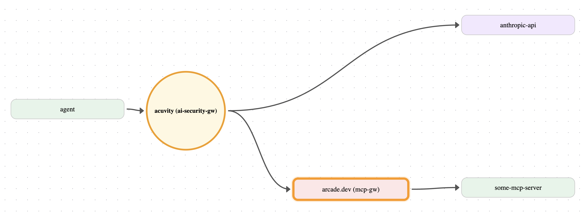

# Simple LangGraph Agent

A minimal LangGraph agent that uses the Acuvity AI Security Gateway.




## Prerequisites

- Python 3.12+
- [uv](https://github.com/astral-sh/uv)
- An [Acuvity](https://console.acuvity.ai) account (for using the AI Security Gateway)
- An [Arcade](https://www.arcade.dev/) account (when using `MCP_SERVER=arcade`)
- An [OpenRouter](https://openrouter.ai/) account (when using `LLM_PROVIDER=openrouter`)

## Environment variables

| Variable | Description |
|---|---|
| `ACUVITY_TOKEN` | Acuvity app token - always required |
| `APEX_URL` | Acuvity gateway URL - always required |
| `LLM_PROVIDER` | `anthropic` (default), `openai`, or `openrouter` |
| `ANTHROPIC_API_KEY` | Required when `LLM_PROVIDER=anthropic` |
| `OPENAI_API_KEY` | Required when `LLM_PROVIDER=openai` |
| `OPENROUTER_API_KEY` | Required when `LLM_PROVIDER=openrouter` |
| `MCP_SERVER` | `arcade` (default) or `local` |
| `ARCADE_API_KEY` | Required when `MCP_SERVER=arcade` |
| `ARCADE_USER_ID` | Required when `MCP_SERVER=arcade` |
| `ARCADE_MCP_URL` | Required when `MCP_SERVER=arcade` |
| `PROMPTS_TYPE` | `simple` (default) or `scenario` |

Advanced overrides (optional):

| Variable | Description |
|---|---|
| `LLM_MODEL` | Model name override. Defaults: `claude-opus-4-6` (Anthropic), `gpt-4o` (OpenAI) |
| `OPENROUTER_MODEL` | OpenRouter model override (default: `stepfun/step-3.5-flash:free`) |
| `LLM_BASE_URL` | Override the API endpoint - enables any third-party compatible API |
| `LLM_API_KEY` | Override the API key - takes precedence over the provider-specific key |

## Getting Acuvity App Token

 - Access your [Acuvity](https://console.acuvity.ai) account
 - Navigate to `Access > App Tokens`
 - Create a token with an appropriate name and description.

## Getting your AI Security Gateway (Apex) URL

 - Go to [https://console.acuvity.ai/me](https://console.acuvity.ai/me)
 - Copy the `Apex` URL under `General` section

## Run

`LLM_PROVIDER` and `MCP_SERVER` are independent - any combination works.

`run.sh` does the following:
- Validates required environment variables based on selected providers
- Sets up `ca.pem` from the Acuvity gateway
- Sets up the Acuvity AI Security Gateway as a proxy for all interactions to LLMs and MCP Servers via `HTTPS_PROXY`
- Runs `main.py` via `uv`

### Step 1 - Always required

```bash
export ACUVITY_TOKEN=...
export APEX_URL=https://...
```

### Step 2 - Pick your LLM

```bash
export ANTHROPIC_API_KEY=...        # anthropic (default)

# OR

export LLM_PROVIDER=openrouter
export OPENROUTER_API_KEY=...       # find models at openrouter.ai/models

# OR

export LLM_PROVIDER=openai
export OPENAI_API_KEY=...           # also works with Together AI, Groq, etc. via LLM_BASE_URL
```

### Step 3 - Pick your MCP server

```bash
export MCP_SERVER=local             # local tools with embedded attack patterns

# OR (arcade is the default - set all three)

export ARCADE_API_KEY=...
export ARCADE_USER_ID=...
export ARCADE_MCP_URL=...
```

### Step 4 - Pick your prompts (optional, default: simple)

```bash
export PROMPTS_TYPE=simple      # basic queries, tool usage, simple injection examples (default)

# OR

export PROMPTS_TYPE=scenario    # detailed multi-step attack scenarios (see docs/test-scenarios.md)
```

### Step 5 - Run

```bash
./run.sh
```
